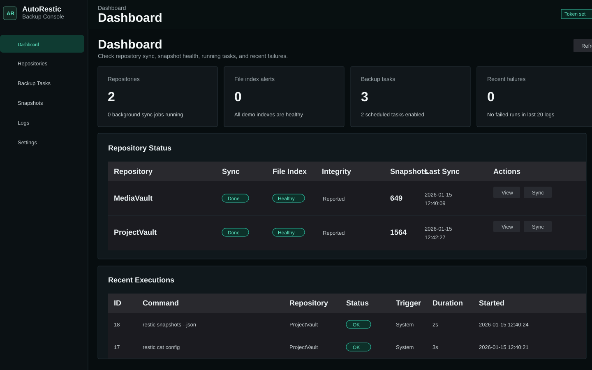
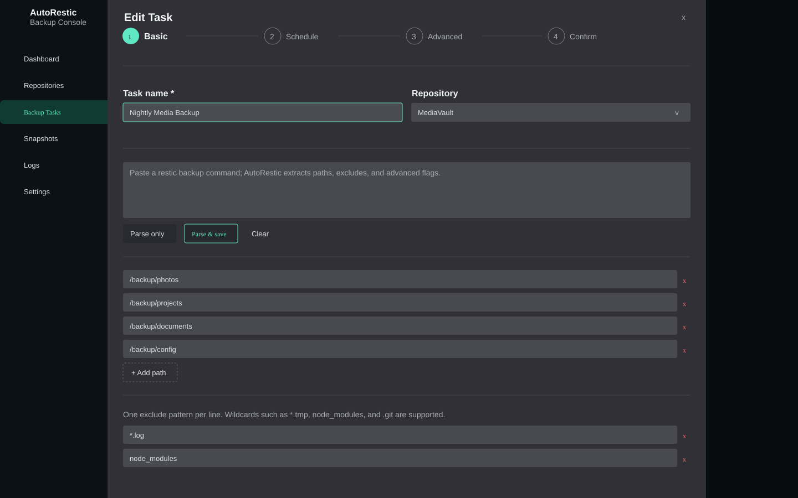
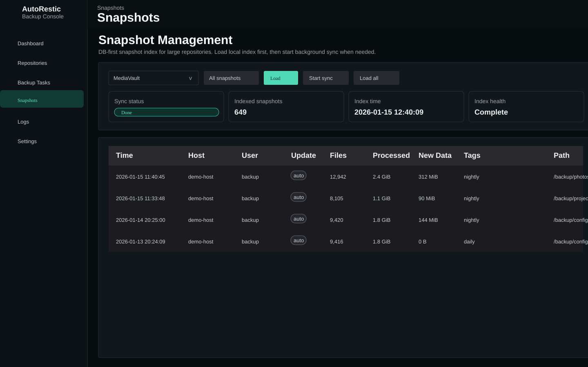
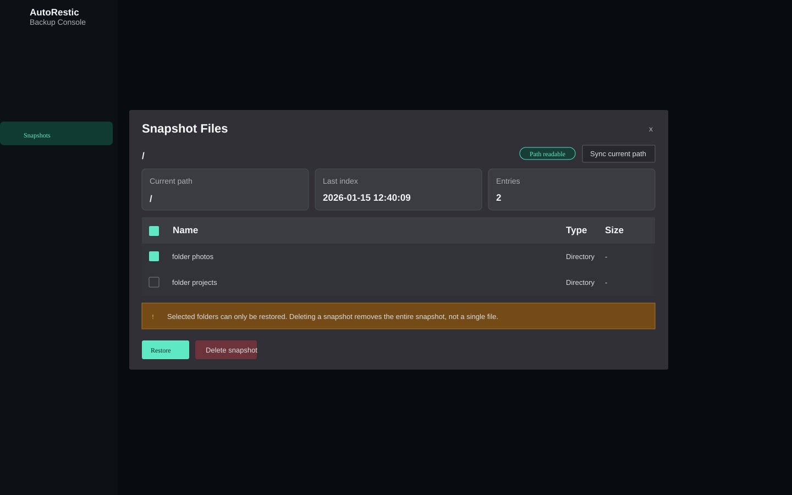
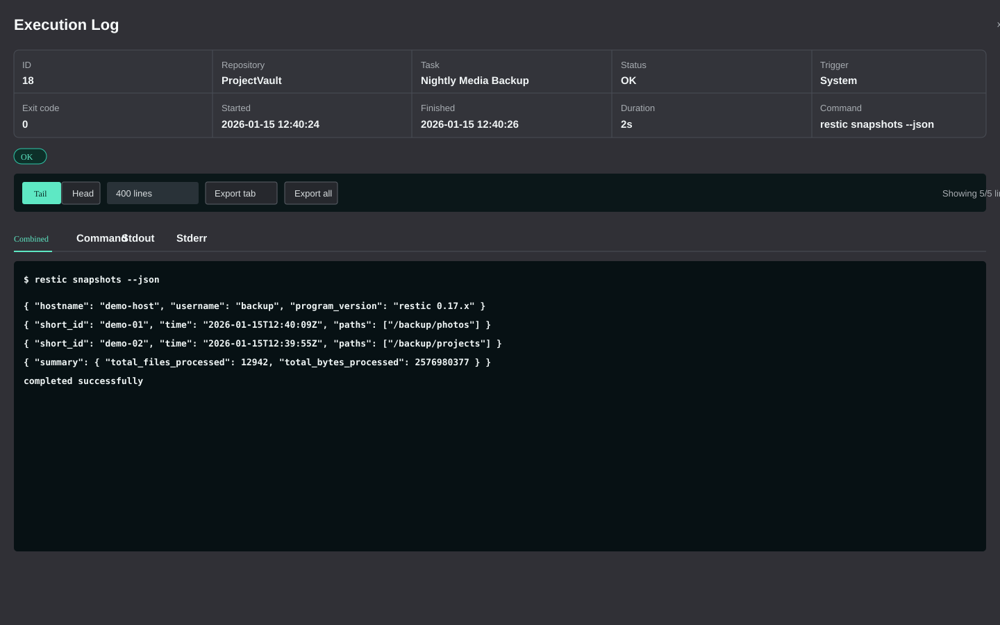

# AutoRestic

[English](README.md)

AutoRestic 是一个自托管的 [restic](https://restic.net/) 仓库管理控制台。它把 Go API、Vue 前端、SQLite 元数据、定时备份任务、快照浏览、恢复操作和执行日志整合到一个适合 Docker 部署的服务里。

AutoRestic 是高权限备份管理工具。它可以读取挂载进容器的源路径、恢复文件、解锁仓库、执行 prune、删除快照。不要在没有认证和网络访问控制的情况下暴露该服务。

## 功能

- 支持 local、rclone、WebDAV 类型的 restic 仓库。
- 仓库密码、rclone 配置和 WebDAV 凭据加密保存。
- 备份任务向导支持路径解析、排除规则、高级 restic 参数和定时调度。
- 面向大仓库的快照索引和文件浏览。
- 支持恢复、删除、check、prune、unlock、sync 等操作。
- 执行日志支持 stdout/stderr 标签和 WebSocket 实时输出。
- 提供 Docker 镜像和 Compose 模板，便于自托管部署。

## 界面截图

以下截图使用公开演示数据，仓库名、主机名、路径、快照 ID 和时间均已脱敏。

### 仪表盘



### 备份任务向导



### 快照



### 快照文件浏览



### 执行日志



## 快速开始

使用已发布镜像：

```bash
export AUTORESTIC_AUTH_TOKEN="$(openssl rand -base64 32)"
docker compose -f docker-compose.image.yml up -d
```

打开：

```text
http://127.0.0.1:8080
```

默认镜像 Compose 文件会把服务绑定到 `127.0.0.1:8080`。除非前面有提供 TLS 和访问控制的可信反向代理，否则建议保持这个默认绑定。

本地构建：

```bash
export AUTORESTIC_AUTH_TOKEN="$(openssl rand -base64 32)"
docker compose up --build -d
```

前端会把 bearer token 保存在浏览器 local storage 中。进入 Settings 页面保存同一个 token 后，再使用依赖 API 的页面。

## Docker

已发布镜像：

```text
pcject/autorestic:latest
```

生产环境建议在发布 tag 可用后固定版本，不要长期依赖 `latest`。

镜像部署示例：

```yaml
services:
  autorestic:
    image: pcject/autorestic:latest
    restart: unless-stopped
    ports:
      - "127.0.0.1:8080:80"
    environment:
      AUTORESTIC_AUTH_TOKEN: ${AUTORESTIC_AUTH_TOKEN:?Set AUTORESTIC_AUTH_TOKEN before starting AutoRestic}
      AUTORESTIC_DB_PATH: /app/data/autorestic.db
      AUTORESTIC_ENC_KEY_PATH: /app/data/autorestic.key
      TZ: ${TZ:-Asia/Shanghai}
    volumes:
      - autorestic-data:/app/data
      # 显式挂载需要备份的源路径，能只读就只读。
      # - /host/photos:/backup/photos:ro
      # - /host/restore:/restore

volumes:
  autorestic-data:
```

构建或拉取镜像后，检查镜像内没有复制本地数据库或 key：

```bash
docker run --rm --entrypoint sh pcject/autorestic:latest -c \
  'find /app -name "autorestic.key" -o -name "*.db" -o -name "*.db-*"'
```

期望结果：无输出。

## 配置项

| 变量 | 默认值 | 说明 |
| --- | --- | --- |
| `AUTORESTIC_PORT` | `8080` | 容器内 Go API 端口 |
| `AUTORESTIC_DB_PATH` | `data/autorestic.db` | SQLite 数据库路径 |
| `AUTORESTIC_ENC_KEY_PATH` | `data/autorestic.key` | 已保存仓库密钥的加密 key 路径 |
| `AUTORESTIC_RESTIC_BIN` | `restic` | restic 可执行文件路径 |
| `AUTORESTIC_AUTH_TOKEN` | 空 | API 访问和 WebSocket ticket 签发使用的 bearer token |
| `AUTORESTIC_CORS_ORIGINS` | 空 | 启用认证时允许的浏览器来源，多个来源用逗号分隔 |

Compose 部署要求设置 `AUTORESTIC_AUTH_TOKEN`，避免误启动一个无认证的文件操作服务。

## 安全说明

- 把 AutoRestic 当作管理员工具使用。
- 除本地开发外，始终设置 `AUTORESTIC_AUTH_TOKEN`。
- 保持默认 `127.0.0.1:8080` 绑定，除非可信反向代理已经提供 TLS 和访问控制。
- 持久化 `/app/data`；丢失 `autorestic.key` 后，已保存的仓库密码无法解密。
- 迁移或更换宿主机前，同时备份 `/app/data/autorestic.db` 和 `/app/data/autorestic.key`。
- 备份源路径尽量只读挂载，恢复操作使用专门的可写目录。
- rclone 配置、WebDAV 密码、仓库密码、本地数据库和 key 文件都应视为敏感信息。
- 不要提交 `backend/data/`、`*.db`、`*.key`、`.env*`、本地 Compose override 或私有规划文件。

## 开发

后端：

```bash
cd backend
go test ./...
go run .
```

前端：

```bash
cd frontend
npm ci
npm run dev
```

生产构建：

```bash
docker build -t pcject/autorestic:dev .
```

## 测试

后端检查：

```bash
cd backend
go test ./...
go test -race ./...
go vet ./...
go run honnef.co/go/tools/cmd/staticcheck@latest ./...
go run golang.org/x/vuln/cmd/govulncheck@latest ./...
```

前端检查：

```bash
cd frontend
npm run typecheck
npm run build
npm audit
```

部署后 smoke test：

1. 启动容器并确认 health 为 `healthy`。
2. 打开 UI，在 Settings 页面保存 bearer token，并确认 Logs 页面可加载。
3. 创建或导入一个测试仓库。
4. 运行一次小型备份，并确认快照出现。
5. 把一个无风险文件恢复到专门的恢复目录。

## 发布检查

- 使用干净初始提交、orphan public branch 或新仓库发布。
- 如果当前私有开发历史包含已删除的内部文件，不要直接推送该历史。
- 公开前确认没有跟踪私有文件：

```bash
git ls-files docs .claude backend/data dist
```

期望结果：无输出。

## 贡献

欢迎提交 issue 和 pull request。请保持改动聚焦；行为变化需要补测试；不要提交本地备份数据、密钥或构建产物。

## 许可证

AutoRestic 使用 [MIT License](LICENSE) 开源。
